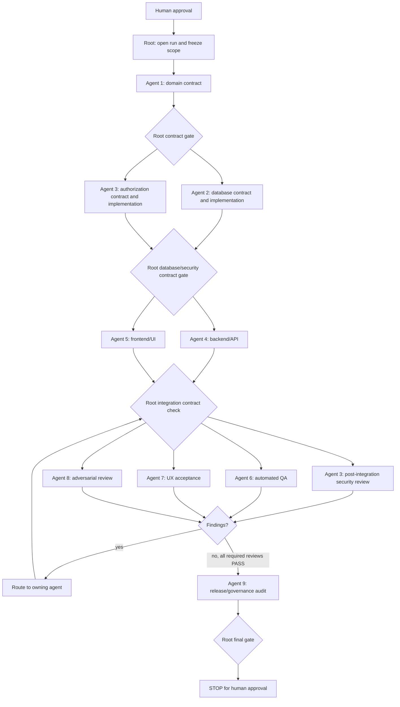

# Governed delivery graph

## Dependency waves

Only 3–5 write-heavy agents may work concurrently. Review-only roles may overlap once their inputs are stable. A dependency node cannot start until every incoming required node is `PASS`.

## Contract gates

1. Domain contract defines semantics, lifecycle, invariants, and future boundaries.
2. Database and authorization contracts translate approved semantics without redefining them.
3. API and UI contracts consume the approved upstream contracts.
4. Testing contract maps every invariant and authorization boundary to independent evidence.

Root records contract hashes or commit IDs in the run's `integration-report.md`. Any semantic contract change invalidates downstream review and returns affected nodes to `BLOCKED` or `READY`.

## Repair routing

| Finding category                             | Required owner |
| -------------------------------------------- | -------------- |
| Domain semantics                             | Agent 1        |
| Prisma, migration, seed, native constraints  | Agent 2        |
| Permission, branch/company/resource security | Agent 3        |
| API, DTO, read model, transactions           | Agent 4        |
| UI, accessibility, responsive behavior       | Agent 5        |
| Test infrastructure or fixture correctness   | Agent 6        |

Agents 7–9 report before remediation and independently recheck repairs. Root may grant a narrowly documented exception, but no agent silently changes another owner's architecture.

## Integration order

1. Approved documentation and contracts.
2. Database migration/schema/seed.
3. Security permissions and policies.
4. Backend/API.
5. Frontend/UI.
6. Independent tests.
7. Owner-routed remediation.
8. Completion and governance reports.

Before each integration, Root reviews the semantic diff, runs `git diff --check`, and executes relevant focused tests. Conflicts are resolved from approved contracts, never by blindly selecting one side.

## Final gate

The final gate requires applicable unit, integration, E2E, authorization, pagination, company/branch isolation, concurrency, N+1, frontend-state, responsive, migration, repeat-seed, clean-checkout, lint, typecheck, build, and governance evidence. Unresolved CRITICAL or HIGH findings force `FAILED`.

After PASS or FAIL, Root freezes the run, records exact evidence, prints the required gate statement, and stops. No next sub-phase or phase begins without explicit user approval.
