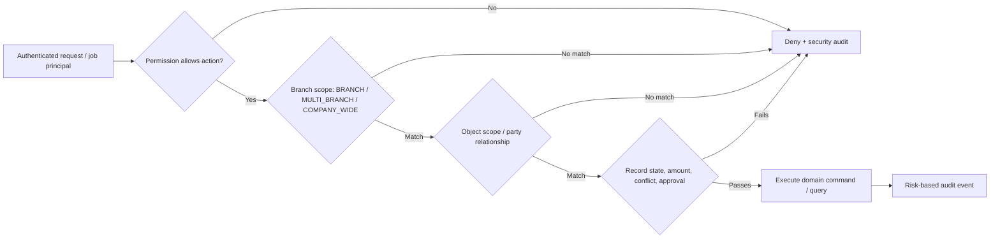

# Authorization Model

```mermaid
flowchart LR
  Request["Authenticated request / job principal"] --> Permission{"Permission allows action?"}
  Permission -->|No| Deny["Deny + security audit"]
  Permission -->|Yes| Branch{"Branch scope: BRANCH / MULTI_BRANCH / COMPANY_WIDE"}
  Branch -->|No match| Deny
  Branch -->|Match| Object{"Object scope / party relationship"}
  Object -->|No match| Deny
  Object -->|Match| State{"Record state, amount, conflict, approval"}
  State -->|Fails| Deny
  State -->|Passes| Execute["Execute domain command / query"]
  Execute --> Audit["Risk-based audit event"]
```
