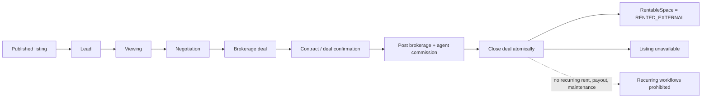

# Brokerage Lifecycle

```mermaid
flowchart LR
  Listing["Published listing"] --> Lead["Lead"]
  Lead --> Viewing["Viewing"]
  Viewing --> Negotiation["Negotiation"]
  Negotiation --> Deal["Brokerage deal"]
  Deal --> Confirmation["Contract / deal confirmation"]
  Confirmation --> Commission["Post brokerage + agent commission"]
  Commission --> Close["Close deal atomically"]
  Close --> External["RentableSpace = RENTED_EXTERNAL"]
  Close --> Unavailable["Listing unavailable"]
  Close -. "no recurring rent, payout, maintenance" .-> Stop["Recurring workflows prohibited"]
```
