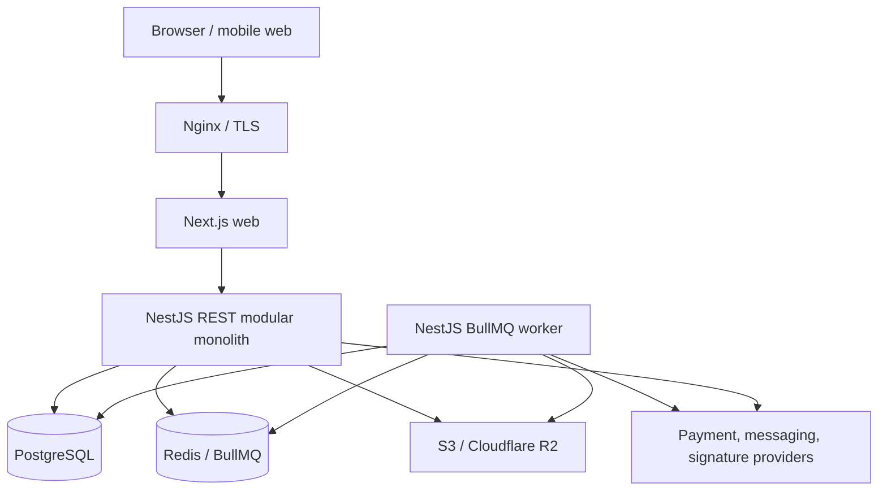

# Container Architecture Diagram

```mermaid
flowchart TB
  Browser["Browser / mobile web"] --> Nginx["Nginx / TLS"]
  Nginx --> Web["Next.js web"]
  Web --> API["NestJS REST modular monolith"]
  API --> DB[("PostgreSQL")]
  API --> Redis[("Redis / BullMQ")]
  Worker["NestJS BullMQ worker"] --> Redis
  Worker --> DB
  API --> Storage["S3 / Cloudflare R2"]
  Worker --> Storage
  Worker --> Providers["Payment, messaging, signature providers"]
  API --> Providers
```
