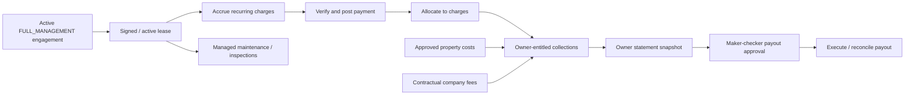

# Full Management Lifecycle

```mermaid
flowchart LR
  Engagement["Active FULL_MANAGEMENT engagement"] --> Lease["Signed / active lease"]
  Lease --> Charges["Accrue recurring charges"]
  Charges --> Payment["Verify and post payment"]
  Payment --> Allocation["Allocate to charges"]
  Allocation --> OwnerLedger["Owner-entitled collections"]
  Expenses["Approved property costs"] --> OwnerLedger
  Fees["Contractual company fees"] --> OwnerLedger
  OwnerLedger --> Statement["Owner statement snapshot"]
  Statement --> Approval["Maker-checker payout approval"]
  Approval --> Payout["Execute / reconcile payout"]
  Lease --> Maintenance["Managed maintenance / inspections"]
```
