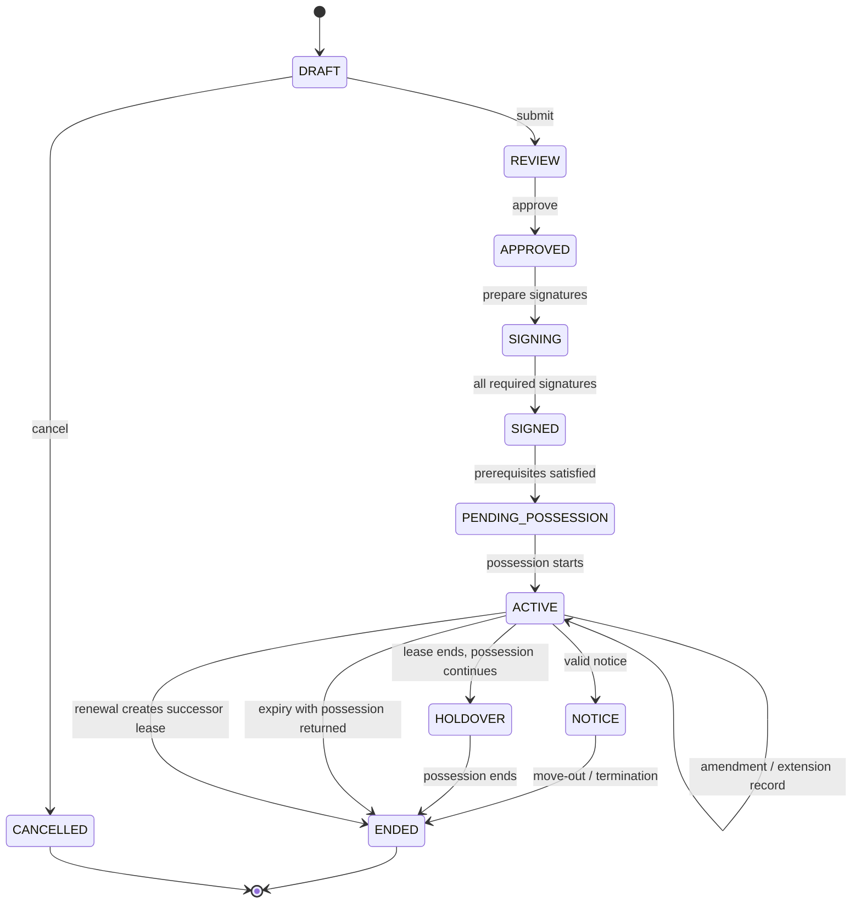

# Leasing Lifecycle

```mermaid
stateDiagram-v2
  [*] --> DRAFT
  DRAFT --> REVIEW: submit
  REVIEW --> APPROVED: approve
  APPROVED --> SIGNING: prepare signatures
  SIGNING --> SIGNED: all required signatures
  SIGNED --> PENDING_POSSESSION: prerequisites satisfied
  PENDING_POSSESSION --> ACTIVE: possession starts
  ACTIVE --> NOTICE: valid notice
  ACTIVE --> HOLDOVER: lease ends, possession continues
  NOTICE --> ENDED: move-out / termination
  HOLDOVER --> ENDED: possession ends
  ACTIVE --> ENDED: expiry with possession returned
  ACTIVE --> ACTIVE: amendment / extension record
  ACTIVE --> ENDED: renewal creates successor lease
  DRAFT --> CANCELLED: cancel
  ENDED --> [*]
  CANCELLED --> [*]
```

Reservations block availability before this lifecycle but do not create occupancy. Active possession intervals are exclusive in MVP.
