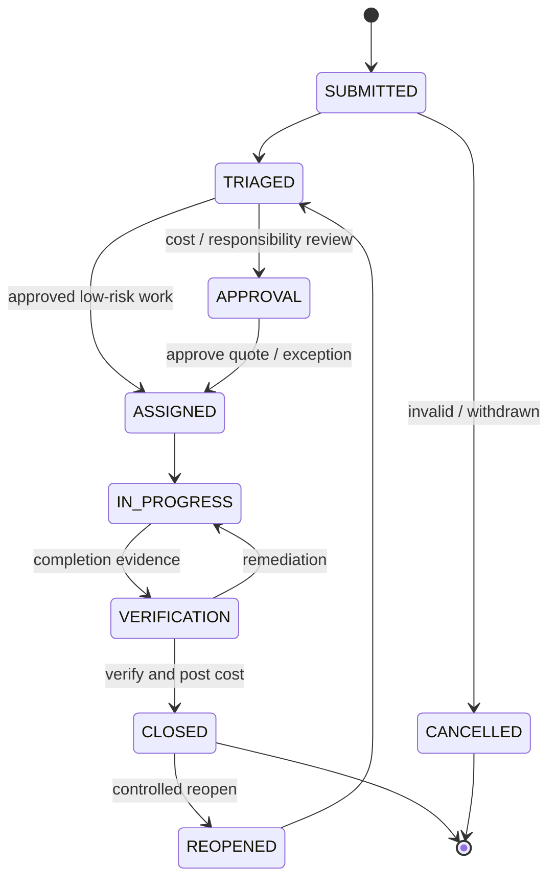

# Maintenance Workflow

```mermaid
stateDiagram-v2
  [*] --> SUBMITTED
  SUBMITTED --> TRIAGED
  TRIAGED --> APPROVAL: cost / responsibility review
  TRIAGED --> ASSIGNED: approved low-risk work
  APPROVAL --> ASSIGNED: approve quote / exception
  ASSIGNED --> IN_PROGRESS
  IN_PROGRESS --> VERIFICATION: completion evidence
  VERIFICATION --> CLOSED: verify and post cost
  VERIFICATION --> IN_PROGRESS: remediation
  CLOSED --> REOPENED: controlled reopen
  REOPENED --> TRIAGED
  SUBMITTED --> CANCELLED: invalid / withdrawn
  CLOSED --> [*]
  CANCELLED --> [*]
```

Emergency bypass requires reason, audit, notification, and post-review.
