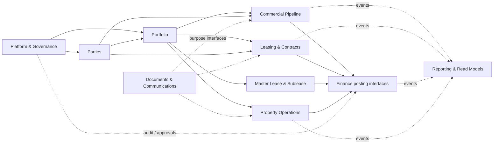

# Major Domain Modules Diagram

```mermaid
flowchart LR
  Platform["Platform & Governance"] --> Parties["Parties"]
  Platform --> Portfolio["Portfolio"]
  Parties --> Portfolio
  Portfolio --> Pipeline["Commercial Pipeline"]
  Parties --> Pipeline
  Portfolio --> Leasing["Leasing & Contracts"]
  Parties --> Leasing
  Portfolio --> Master["Master Lease & Sublease"]
  Portfolio --> Operations["Property Operations"]
  Pipeline --> Finance["Finance posting interfaces"]
  Leasing --> Finance
  Master --> Finance
  Operations --> Finance
  Content["Documents & Communications"] -. "purpose interfaces" .-> Pipeline
  Content -.-> Leasing
  Content -.-> Operations
  Platform -. "audit / approvals" .-> Finance
  Pipeline -. "events" .-> Reporting["Reporting & Read Models"]
  Leasing -. "events" .-> Reporting
  Finance -. "events" .-> Reporting
  Operations -. "events" .-> Reporting
```
