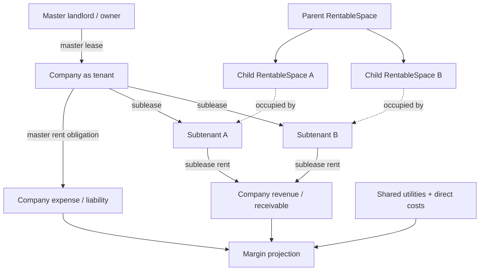

# Master Lease and Sublease Relationship

```mermaid
flowchart TB
  Owner["Master landlord / owner"] -->|"master lease"| Company["Company as tenant"]
  Company -->|"master rent obligation"| MasterCost["Company expense / liability"]
  Parent["Parent RentableSpace"] --> ChildA["Child RentableSpace A"]
  Parent --> ChildB["Child RentableSpace B"]
  Company -->|"sublease"| TenantA["Subtenant A"]
  Company -->|"sublease"| TenantB["Subtenant B"]
  TenantA -->|"sublease rent"| Revenue["Company revenue / receivable"]
  TenantB -->|"sublease rent"| Revenue
  Shared["Shared utilities + direct costs"] --> Margin["Margin projection"]
  Revenue --> Margin
  MasterCost --> Margin
  ChildA -. occupied by .-> TenantA
  ChildB -. occupied by .-> TenantB
```
