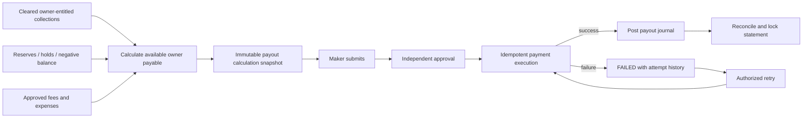

# Owner Payout Flow

```mermaid
flowchart LR
  Cleared["Cleared owner-entitled collections"] --> Calc["Calculate available owner payable"]
  Reserve["Reserves / holds / negative balance"] --> Calc
  Fees["Approved fees and expenses"] --> Calc
  Calc --> Draft["Immutable payout calculation snapshot"]
  Draft --> Maker["Maker submits"]
  Maker --> Checker["Independent approval"]
  Checker --> Execute["Idempotent payment execution"]
  Execute -->|"success"| Posted["Post payout journal"]
  Posted --> Reconcile["Reconcile and lock statement"]
  Execute -->|"failure"| Failed["FAILED with attempt history"]
  Failed --> Retry["Authorized retry"]
  Retry --> Execute
```
