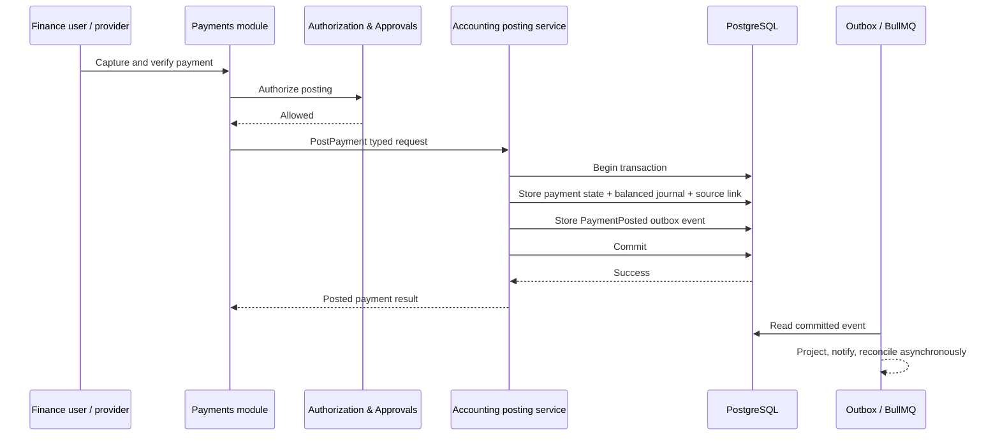

# Payment and Accounting Flow

```mermaid
sequenceDiagram
  participant User as Finance user / provider
  participant Pay as Payments module
  participant Auth as Authorization & Approvals
  participant GL as Accounting posting service
  participant DB as PostgreSQL
  participant Outbox as Outbox / BullMQ
  User->>Pay: Capture and verify payment
  Pay->>Auth: Authorize posting
  Auth-->>Pay: Allowed
  Pay->>GL: PostPayment typed request
  GL->>DB: Begin transaction
  GL->>DB: Store payment state + balanced journal + source link
  GL->>DB: Store PaymentPosted outbox event
  GL->>DB: Commit
  DB-->>GL: Success
  GL-->>Pay: Posted payment result
  Outbox->>DB: Read committed event
  Outbox-->>Outbox: Project, notify, reconcile asynchronously
```
