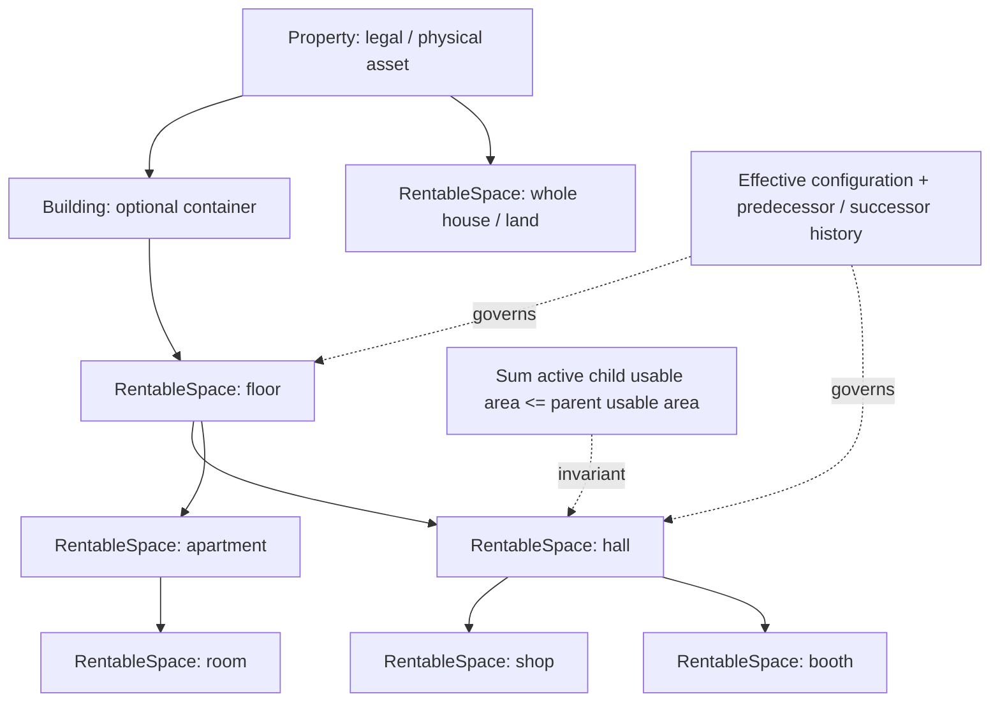

# Property and RentableSpace Hierarchy

```mermaid
flowchart TB
  Property["Property: legal / physical asset"] --> Building["Building: optional container"]
  Property --> Whole["RentableSpace: whole house / land"]
  Building --> Floor["RentableSpace: floor"]
  Floor --> Hall["RentableSpace: hall"]
  Hall --> Shop["RentableSpace: shop"]
  Hall --> Booth["RentableSpace: booth"]
  Floor --> Apartment["RentableSpace: apartment"]
  Apartment --> Room["RentableSpace: room"]
  Config["Effective configuration + predecessor / successor history"] -. governs .-> Floor
  Config -. governs .-> Hall
  Rule["Sum active child usable area <= parent usable area"] -. invariant .-> Hall
```
