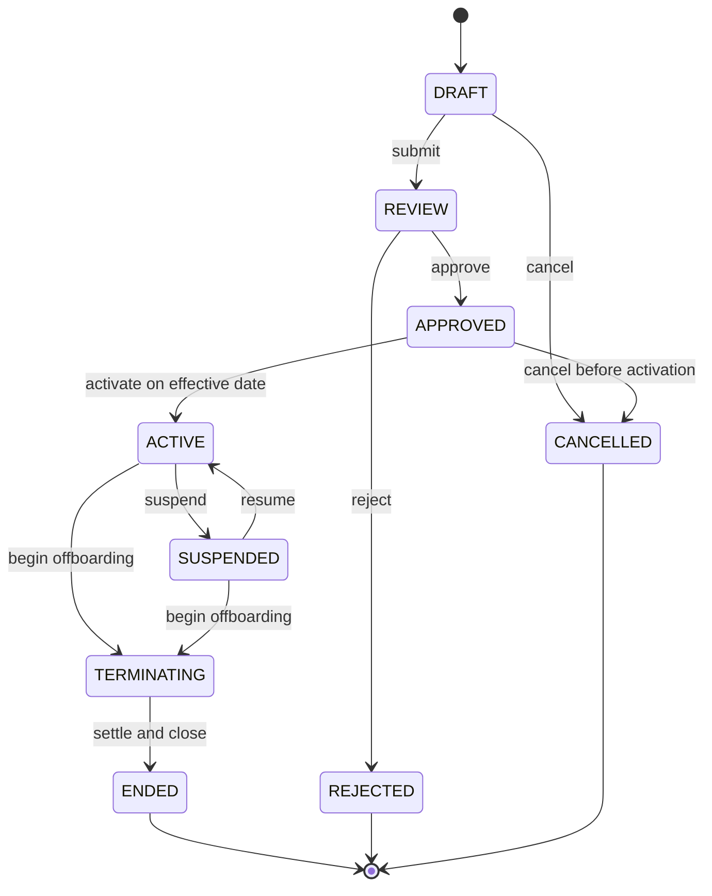

# Service Engagement Lifecycle

```mermaid
stateDiagram-v2
  [*] --> DRAFT
  DRAFT --> REVIEW: submit
  REVIEW --> APPROVED: approve
  REVIEW --> REJECTED: reject
  APPROVED --> ACTIVE: activate on effective date
  ACTIVE --> SUSPENDED: suspend
  SUSPENDED --> ACTIVE: resume
  ACTIVE --> TERMINATING: begin offboarding
  SUSPENDED --> TERMINATING: begin offboarding
  TERMINATING --> ENDED: settle and close
  DRAFT --> CANCELLED: cancel
  APPROVED --> CANCELLED: cancel before activation
  ENDED --> [*]
  REJECTED --> [*]
  CANCELLED --> [*]
```

Compatibility and effective-date checks prevent silent overlap; compatible child-space engagements may explicitly override inherited property engagements.
