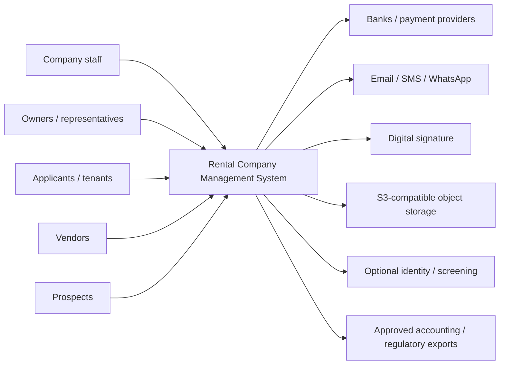

# System Context Diagram

```mermaid
flowchart LR
  Staff["Company staff"] --> System["Rental Company Management System"]
  Owners["Owners / representatives"] --> System
  Tenants["Applicants / tenants"] --> System
  Vendors["Vendors"] --> System
  Public["Prospects"] --> System
  System --> Payments["Banks / payment providers"]
  System --> Messaging["Email / SMS / WhatsApp"]
  System --> Signature["Digital signature"]
  System --> Storage["S3-compatible object storage"]
  System --> Screening["Optional identity / screening"]
  System --> Exports["Approved accounting / regulatory exports"]
```
