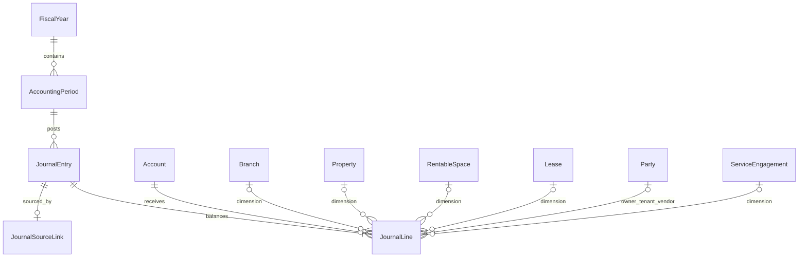

# Accounting ERD

```mermaid
erDiagram
  FiscalYear ||--o{ AccountingPeriod : contains
  AccountingPeriod ||--o{ JournalEntry : posts
  JournalEntry ||--|{ JournalLine : balances
  Account ||--o{ JournalLine : receives
  Branch o|--o{ JournalLine : dimension
  Property o|--o{ JournalLine : dimension
  RentableSpace o|--o{ JournalLine : dimension
  Lease o|--o{ JournalLine : dimension
  Party o|--o{ JournalLine : owner_tenant_vendor
  ServiceEngagement o|--o{ JournalLine : dimension
  JournalEntry ||--o| JournalSourceLink : sourced_by
```
