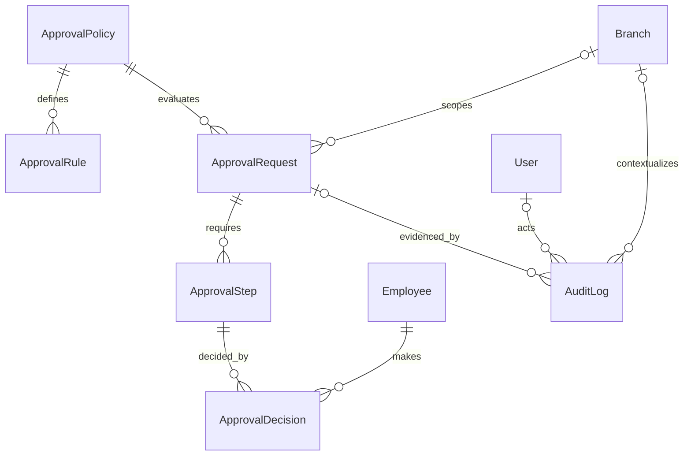

# Approvals and Audit ERD

```mermaid
erDiagram
  ApprovalPolicy ||--o{ ApprovalRule : defines
  ApprovalPolicy ||--o{ ApprovalRequest : evaluates
  ApprovalRequest ||--o{ ApprovalStep : requires
  ApprovalStep ||--o{ ApprovalDecision : decided_by
  Employee ||--o{ ApprovalDecision : makes
  Branch o|--o{ ApprovalRequest : scopes
  User o|--o{ AuditLog : acts
  Branch o|--o{ AuditLog : contextualizes
  ApprovalRequest o|--o{ AuditLog : evidenced_by
```
