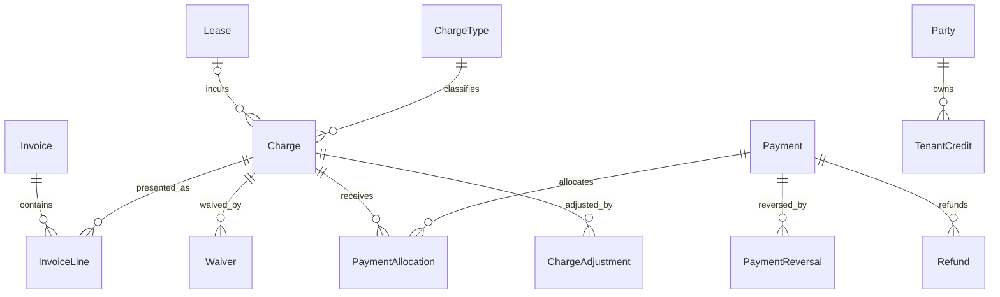

# Billing and Payments ERD

```mermaid
erDiagram
  ChargeType ||--o{ Charge : classifies
  Lease o|--o{ Charge : incurs
  Charge ||--o{ InvoiceLine : presented_as
  Invoice ||--o{ InvoiceLine : contains
  Payment ||--o{ PaymentAllocation : allocates
  Charge ||--o{ PaymentAllocation : receives
  Payment ||--o{ PaymentReversal : reversed_by
  Payment ||--o{ Refund : refunds
  Party ||--o{ TenantCredit : owns
  Charge ||--o{ Waiver : waived_by
  Charge ||--o{ ChargeAdjustment : adjusted_by
```
