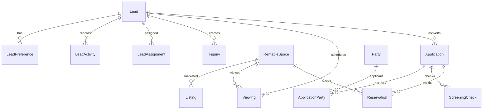

# CRM and Applications ERD

```mermaid
erDiagram
  Lead ||--o{ LeadPreference : has
  Lead ||--o{ LeadActivity : records
  Lead ||--o{ LeadAssignment : assigned
  Lead ||--o{ Inquiry : creates
  Lead ||--o{ Viewing : schedules
  RentableSpace ||--o{ Listing : marketed
  RentableSpace ||--o{ Viewing : viewed
  Lead ||--o{ Application : converts
  Application ||--o{ ApplicationParty : includes
  Party ||--o{ ApplicationParty : applicant
  Application ||--o{ ScreeningCheck : checks
  Application ||--o{ Reservation : yields
  RentableSpace ||--o{ Reservation : blocks
```
