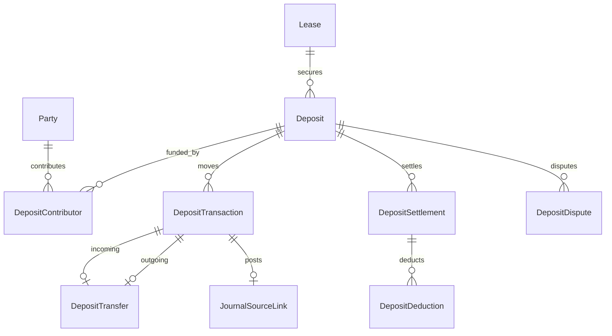

# Deposits ERD

```mermaid
erDiagram
  Lease ||--o{ Deposit : secures
  Deposit ||--o{ DepositContributor : funded_by
  Party ||--o{ DepositContributor : contributes
  Deposit ||--o{ DepositTransaction : moves
  Deposit ||--o{ DepositSettlement : settles
  DepositSettlement ||--o{ DepositDeduction : deducts
  Deposit ||--o{ DepositDispute : disputes
  DepositTransaction ||--o| DepositTransfer : outgoing
  DepositTransaction ||--o| DepositTransfer : incoming
  DepositTransaction ||--o| JournalSourceLink : posts
```
