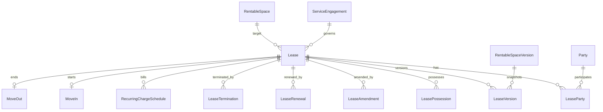

# Leasing ERD

```mermaid
erDiagram
  RentableSpace ||--o{ Lease : target
  ServiceEngagement ||--o{ Lease : governs
  Lease ||--o{ LeaseParty : has
  Party ||--o{ LeaseParty : participates
  Lease ||--o{ LeaseVersion : versions
  RentableSpaceVersion ||--o{ LeaseVersion : snapshots
  Lease ||--o{ LeasePossession : possesses
  Lease ||--o{ LeaseAmendment : amended_by
  Lease ||--o{ LeaseRenewal : renewed_by
  Lease ||--o{ LeaseTermination : terminated_by
  Lease ||--o{ RecurringChargeSchedule : bills
  Lease ||--o| MoveIn : starts
  Lease ||--o| MoveOut : ends
```
