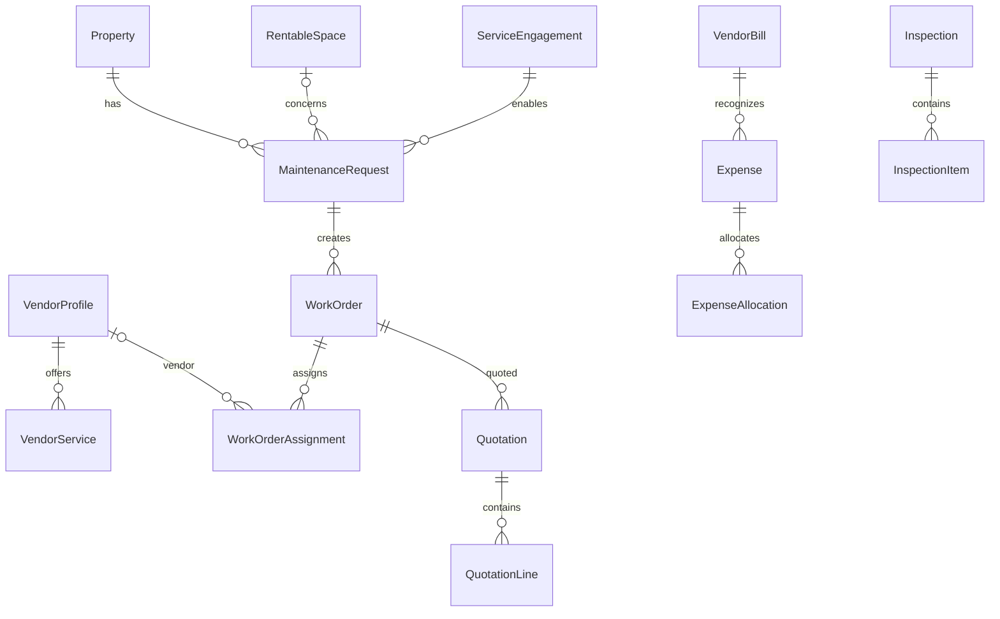

# Maintenance and Vendors ERD

```mermaid
erDiagram
  VendorProfile ||--o{ VendorService : offers
  Property ||--o{ MaintenanceRequest : has
  RentableSpace o|--o{ MaintenanceRequest : concerns
  ServiceEngagement ||--o{ MaintenanceRequest : enables
  MaintenanceRequest ||--o{ WorkOrder : creates
  WorkOrder ||--o{ WorkOrderAssignment : assigns
  VendorProfile o|--o{ WorkOrderAssignment : vendor
  WorkOrder ||--o{ Quotation : quoted
  Quotation ||--o{ QuotationLine : contains
  VendorBill ||--o{ Expense : recognizes
  Expense ||--o{ ExpenseAllocation : allocates
  Inspection ||--o{ InspectionItem : contains
```
