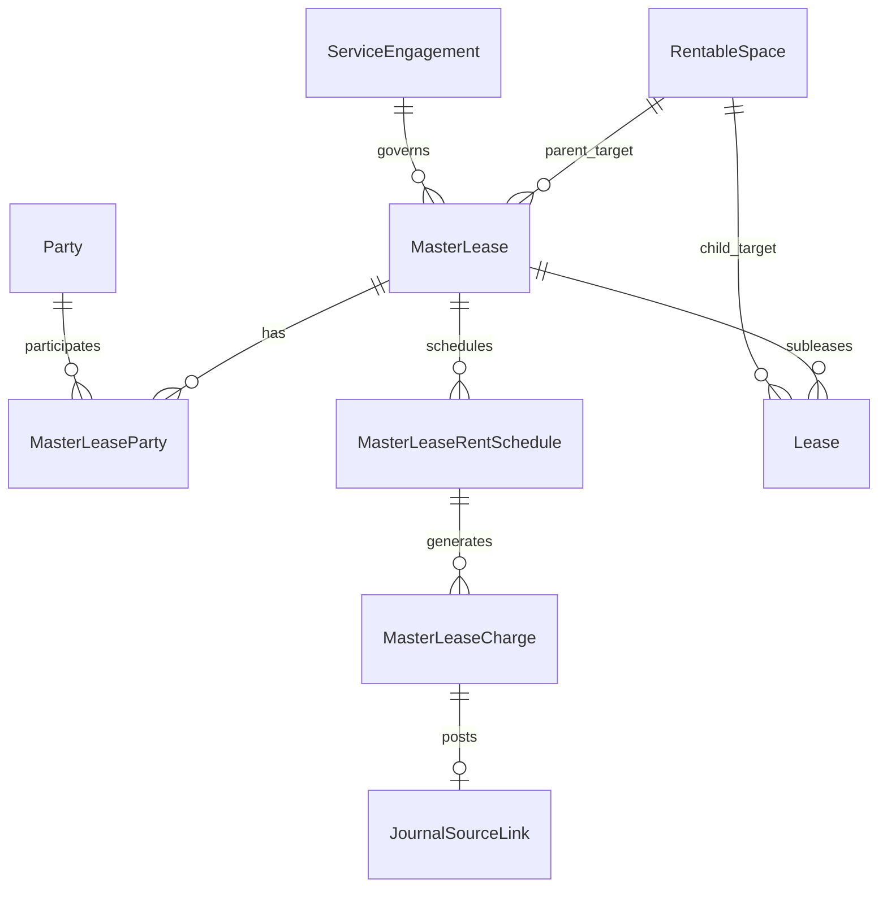

# Master Lease and Sublease ERD

```mermaid
erDiagram
  RentableSpace ||--o{ MasterLease : parent_target
  ServiceEngagement ||--o{ MasterLease : governs
  MasterLease ||--o{ MasterLeaseParty : has
  Party ||--o{ MasterLeaseParty : participates
  MasterLease ||--o{ MasterLeaseRentSchedule : schedules
  MasterLeaseRentSchedule ||--o{ MasterLeaseCharge : generates
  MasterLease ||--o{ Lease : subleases
  RentableSpace ||--o{ Lease : child_target
  MasterLeaseCharge ||--o| JournalSourceLink : posts
```
