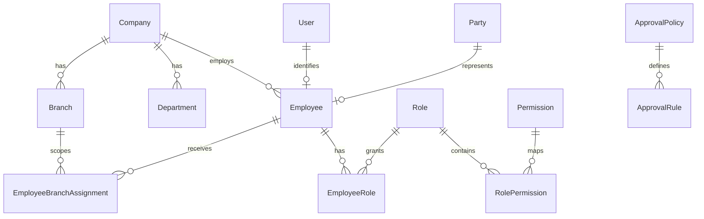

# Organization and Access ERD

```mermaid
erDiagram
  Company ||--o{ Branch : has
  Company ||--o{ Department : has
  Company ||--o{ Employee : employs
  User ||--o| Employee : identifies
  Party ||--o| Employee : represents
  Employee ||--o{ EmployeeBranchAssignment : receives
  Branch ||--o{ EmployeeBranchAssignment : scopes
  Employee ||--o{ EmployeeRole : has
  Role ||--o{ EmployeeRole : grants
  Role ||--o{ RolePermission : contains
  Permission ||--o{ RolePermission : maps
  ApprovalPolicy ||--o{ ApprovalRule : defines
```
