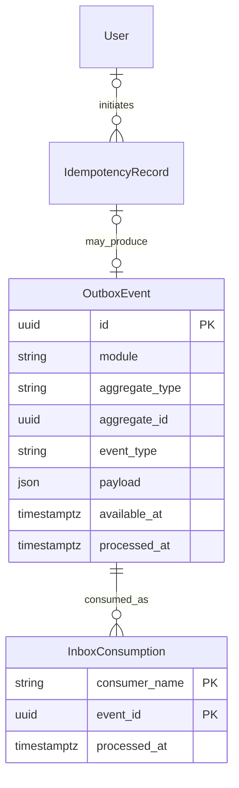

# Outbox and Events ERD

```mermaid
erDiagram
  OutboxEvent ||--o{ InboxConsumption : consumed_as
  IdempotencyRecord o|--o| OutboxEvent : may_produce
  User o|--o{ IdempotencyRecord : initiates
  OutboxEvent {
    uuid id PK
    string module
    string aggregate_type
    uuid aggregate_id
    string event_type
    json payload
    timestamptz available_at
    timestamptz processed_at
  }
  InboxConsumption {
    string consumer_name PK
    uuid event_id PK
    timestamptz processed_at
  }
```
