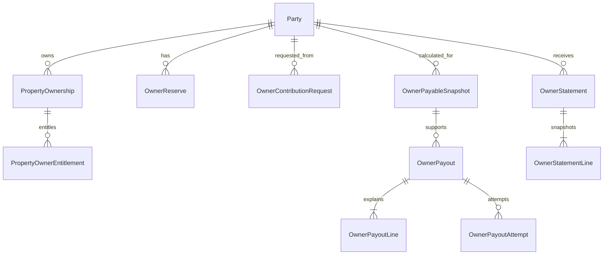

# Owner Accounting ERD

```mermaid
erDiagram
  Party ||--o{ PropertyOwnership : owns
  PropertyOwnership ||--o{ PropertyOwnerEntitlement : entitles
  Party ||--o{ OwnerReserve : has
  Party ||--o{ OwnerContributionRequest : requested_from
  Party ||--o{ OwnerPayableSnapshot : calculated_for
  OwnerPayableSnapshot ||--o{ OwnerPayout : supports
  OwnerPayout ||--|{ OwnerPayoutLine : explains
  OwnerPayout ||--o{ OwnerPayoutAttempt : attempts
  Party ||--o{ OwnerStatement : receives
  OwnerStatement ||--|{ OwnerStatementLine : snapshots
```
