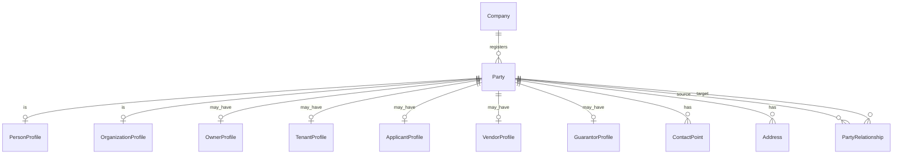

# Parties ERD

```mermaid
erDiagram
  Company ||--o{ Party : registers
  Party ||--o| PersonProfile : is
  Party ||--o| OrganizationProfile : is
  Party ||--o| OwnerProfile : may_have
  Party ||--o| TenantProfile : may_have
  Party ||--o| ApplicantProfile : may_have
  Party ||--o| VendorProfile : may_have
  Party ||--o| GuarantorProfile : may_have
  Party ||--o{ ContactPoint : has
  Party ||--o{ Address : has
  Party ||--o{ PartyRelationship : source
  Party ||--o{ PartyRelationship : target
```
