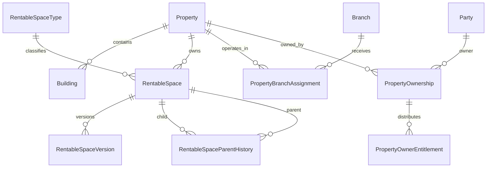

# Portfolio and RentableSpace ERD

```mermaid
erDiagram
  Property ||--o{ Building : contains
  Property ||--o{ RentableSpace : owns
  RentableSpaceType ||--o{ RentableSpace : classifies
  RentableSpace ||--o{ RentableSpaceVersion : versions
  RentableSpace ||--o{ RentableSpaceParentHistory : child
  RentableSpace ||--o{ RentableSpaceParentHistory : parent
  Property ||--o{ PropertyBranchAssignment : operates_in
  Branch ||--o{ PropertyBranchAssignment : receives
  Property ||--o{ PropertyOwnership : owned_by
  Party ||--o{ PropertyOwnership : owner
  PropertyOwnership ||--o{ PropertyOwnerEntitlement : distributes
```
