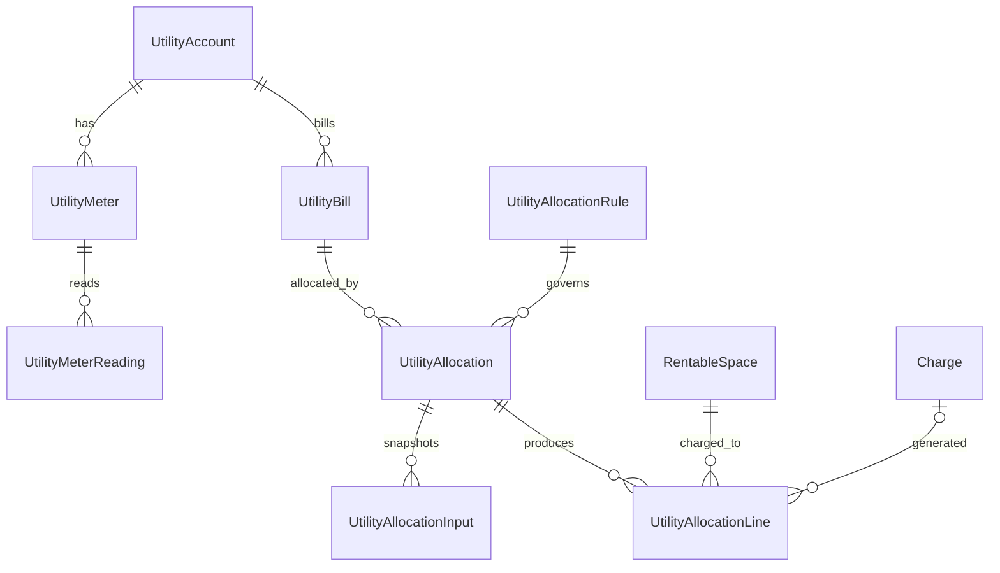

# Utilities ERD

```mermaid
erDiagram
  UtilityAccount ||--o{ UtilityMeter : has
  UtilityMeter ||--o{ UtilityMeterReading : reads
  UtilityAccount ||--o{ UtilityBill : bills
  UtilityBill ||--o{ UtilityAllocation : allocated_by
  UtilityAllocationRule ||--o{ UtilityAllocation : governs
  UtilityAllocation ||--o{ UtilityAllocationInput : snapshots
  UtilityAllocation ||--o{ UtilityAllocationLine : produces
  RentableSpace ||--o{ UtilityAllocationLine : charged_to
  Charge o|--o{ UtilityAllocationLine : generated
```
